# GCE — Global Compliance Engine

<div align="center">


**A high-performance, real-time pre-trade risk management & regulatory compliance engine for Hong Kong (HKEX) and global securities trading.**

[Key Features](#-key-features) • [Application Visuals](#-application-showcase) • [Architecture](#-system-architecture) • [Control Center GUI](#-gce-control-center-gui) • [SQLite Schema](#-sqlite-database-schema-rms_control_limits) • [Quick Start](#-quick-start) • [Python SDK](#-python-sdk--usage-examples) • [Testing](#-running-tests)

</div>

---

## ⚡ Overview

**GCE (Global Compliance Engine)** provides ultra-low-latency pre-trade order validation, real-time position and turnover tracking, automated multi-currency FX conversions, static instrument universe management, exchange session state tracking, and SQLite RMS risk rules enforcement.

Designed for high-frequency algorithmic and DMA (Direct Market Access) trading desks, GCE validates incoming orders against configurable limit checks in microseconds before order acceptance, featuring nanosecond-precision audit logging and an interactive glassmorphic web dashboard.

---

## 🌟 Key Features

- **High-Performance Pre-Trade Controls**:
  - `MaxOrderQuantity`: Caps maximum single order share size (mapped to `MaxOrderSize`).
  - `MaxOrderPrice`: Hard ceiling on allowable unit order price.
  - `MaxOrderConsideration`: Enforces gross order notional threshold (`Price × Quantity`, mapped to `MaxOrderValue`).
  - `ClosePriceTolerance`: Dynamic percentage corridor tolerance relative to previous closing price.
  - `LastPriceTolerance`: Dynamic percentage corridor tolerance relative to last traded market price.
  - `BBOPriceTolerance`: Best Bid / Offer price tolerance check against top-of-book quotes.
  - `MaxDailyTurnover`: Intraday pattern-aggregated gross traded turnover ceiling.
  - `Restricted` & `SSRestricted`: Real-time stock restriction & short-selling eligibility validation.
  - `DuplicateOrders` & `BurstOrders`: Sliding window rate limiters (`"x,y"` format e.g., max 10 orders per 60s).
  - `Order Amendments & Cancellations`: State machine transition checks and remaining quantity validation.
- **Pure Binary `.DAT` Cache Persistence**:
  - Eliminates slow CSV parsing with ultra-fast binary serialization snapshots (`PriceCache.dat`, `InstrumentStatic.dat`, `OrderCache.dat`, `PositionsCache.dat`).
  - Instant cold-start recovery with zero runtime deserialization lag.
- **DataMgr & SQLite RMS Limits DB (`rms_limits.db`)**:
  - 49-column comprehensive risk control rules schema.
  - In-memory cached rules with hierarchical wildcard matching (`Product`, `SecurityType`, `Trader`, `Desk`, `Account`, `symbol`, `exchange`, `Currency`, etc.).
  - On-demand database reloading and bulk CSV replacement (`replace_limits_from_csv`).
  - 17,635+ HKEX securities indexed with RIC masterkey lookup (`0700.HK`, `00001.HK`) and stock code aliases.
- **Multi-Currency FX Engine (`PXFeeder`)**:
  - Real-time market data feed and currency conversion engine.
  - Built-in live fetch for major APAC, EU, and US currency pairs (`USD`, `EUR`, `GBP`, `JPY`, `HKD`, `AUD`, `SGD`, `CNH`, `CAD`, `CHF`).
- **Real-Time Intraday Positions & Reconciliation**:
  - Tracks pattern-level position aggregations (Buy Qty, Sell Qty, Net Qty, Gross Value, Realized PnL).
  - Automated reconciliation auditing executed fills against position books with discrepancy alerts.
- **Nanosecond-Precision Structured Logging**:
  - Every compliance decision logs exact limit values, evaluated order values, caller filename, line number, and nanosecond execution timings (e.g. `{price_control.py:19 2800 nano seconds}`).
- **GCE Control Center Web GUI**:
  - Full-featured dark-mode glassmorphism dashboard with 14 modular tabs, real-time Chart.js visualizations, order placement facility, 49-column limits manager, and log lifecycle tools.

---

## 📸 Application Showcase

### 1. Services Overview & Sub-Service Monitor
Real-time operational status, uptime tracking, and Start / Stop / Restart controls for all core services (`GCE Engine`, `PX Feeder`, `Log Worker`, and `Data Manager`).

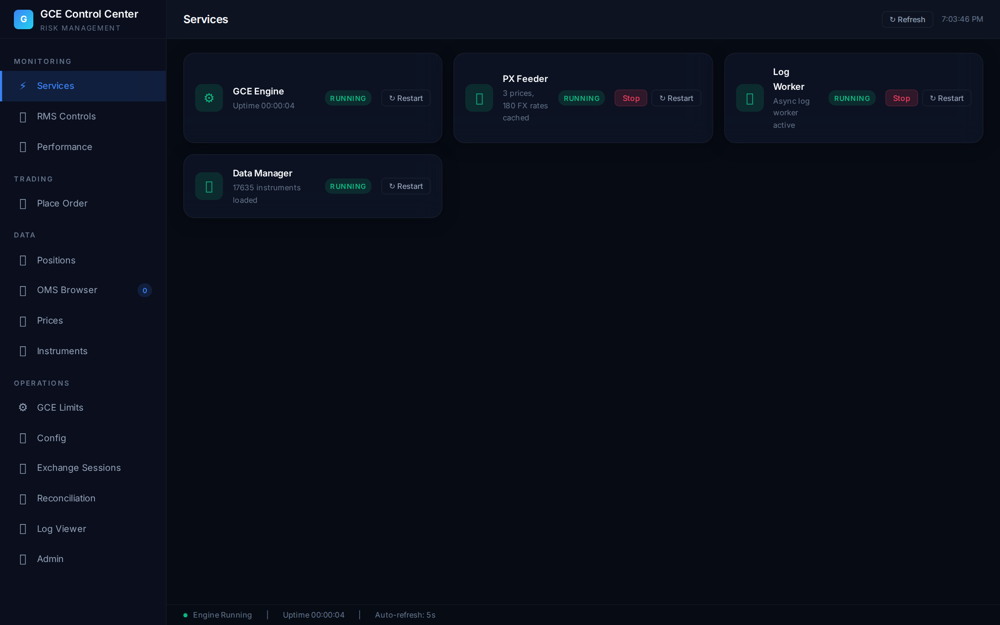

---

### 2. RMS Controls Pass/Fail Analytics & Drill-Down
Real-time evaluation statistics, Pass/Fail bar charts per risk control, and expandable order drill-down with exact limit comparisons and nanosecond execution times.

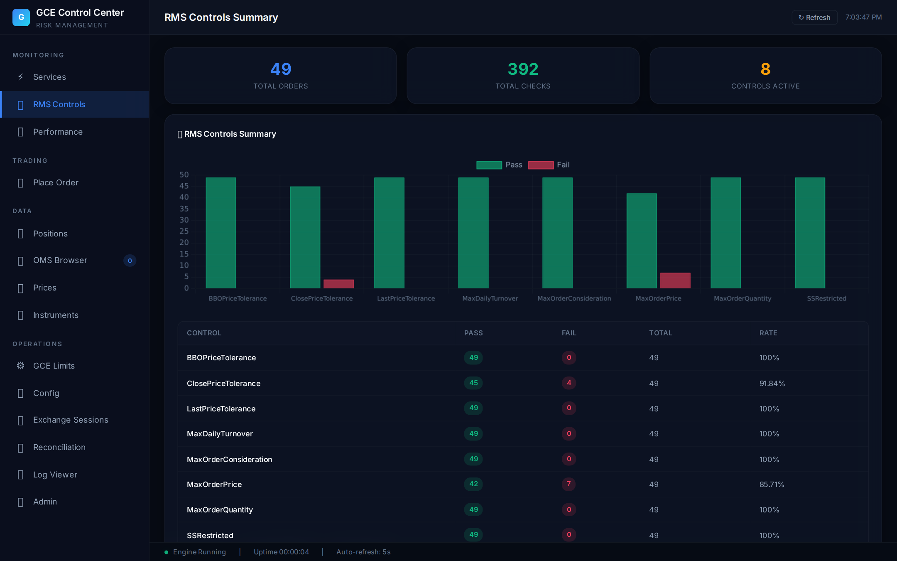

---

### 3. Performance & Nanosecond Latency Metrics
Live sub-millisecond validation latency line chart (averaging < 0.1ms) alongside stacked bar charts displaying per-control nanosecond execution breakdowns.

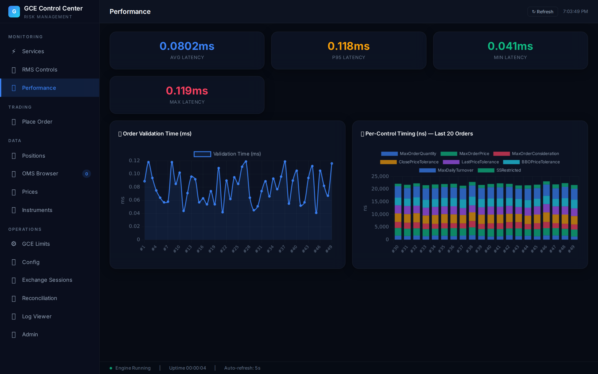

---

### 4. Pre-Trade Risk Validation & Order Placement Ticket
Interactive order entry ticket with automatic RIC autocomplete, static attribute population (Category, Exchange, Currency, Market Price), and instant pass/fail validation before routing to the OMS.

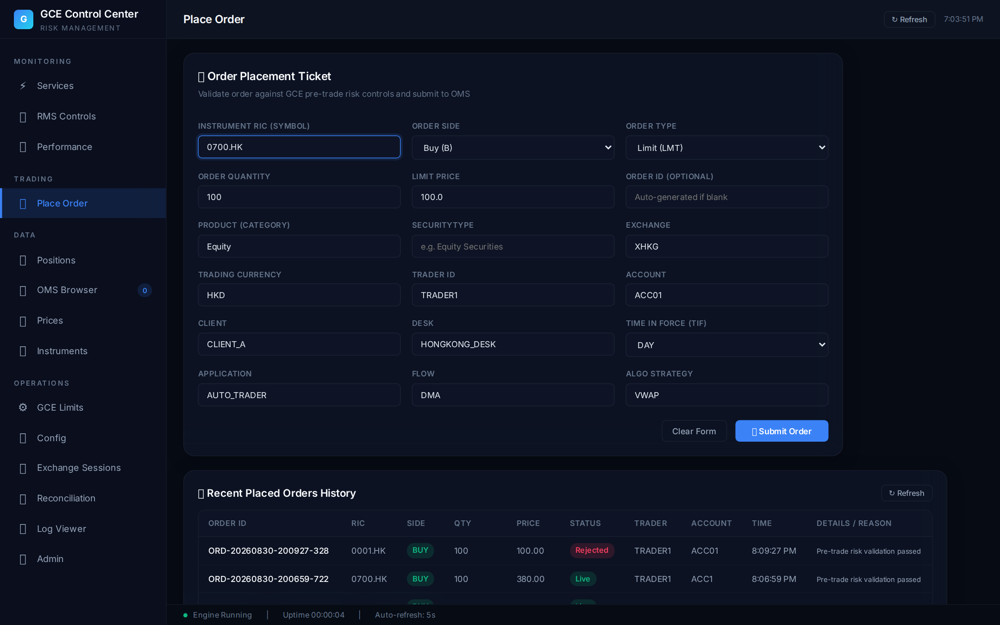

---

### 5. Real-Time Intraday Positions & Turnover Dashboard
Aggregated position books with KPI cards for Gross Traded Turnover (HKD), Buy Value, Sell Value, and pattern-level net position breakdowns.

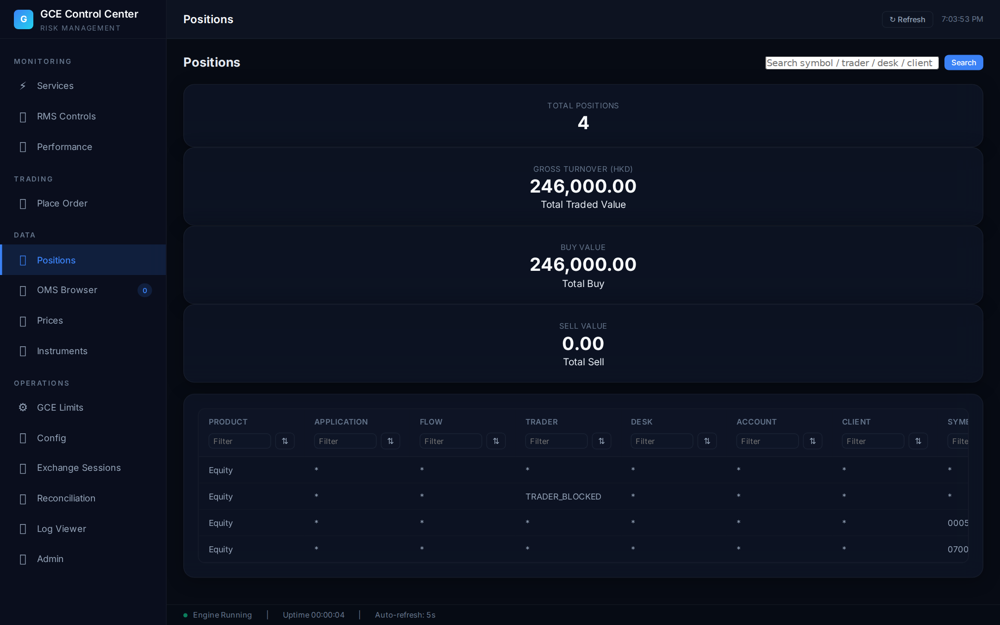

---

### 6. Live OMS Order Book Browser
Interactive order management browser supporting status filtering (`Live`, `Fill`, `Partial Fill`, `Rejected`, `Cancelled`), live fill progress bars, and pagination.

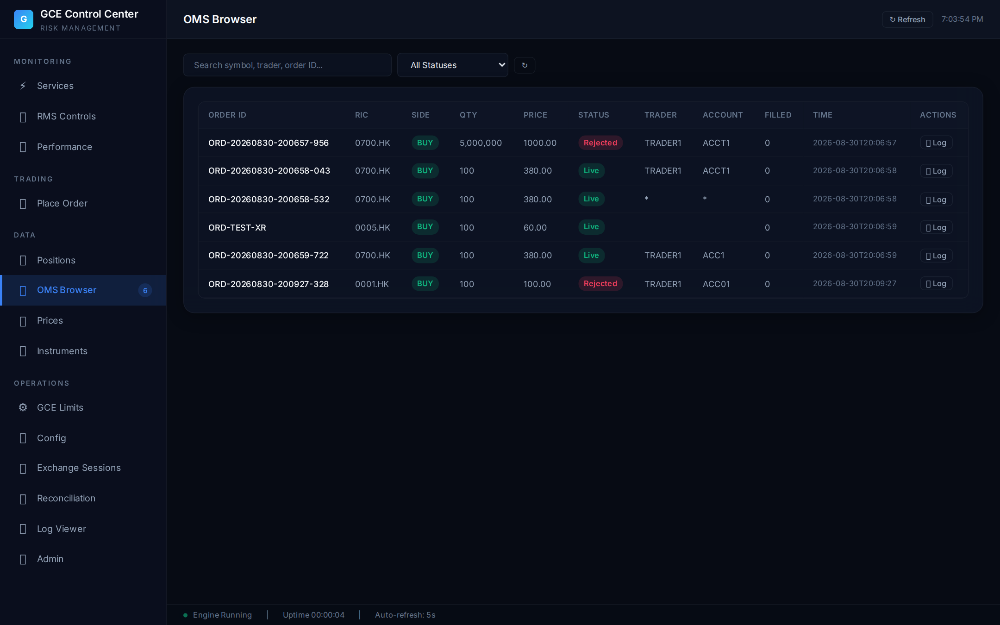

---

### 7. Market Prices Cache (Bid / Ask / Last / Close / Mid)
In-memory market price cache with real-time RIC search, full CRUD editing (Add/Edit/Delete), and on-demand binary `.dat` persistence.

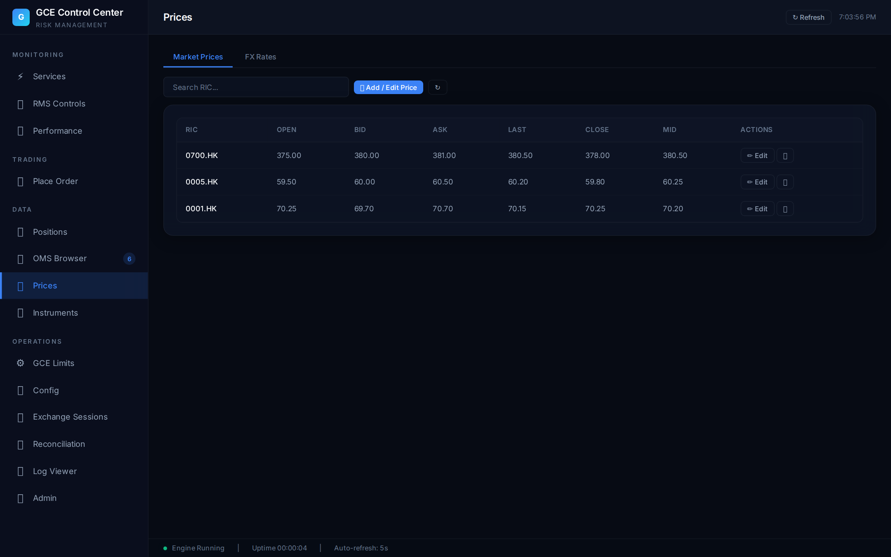

---

### 8. Multi-Currency FX Rates Hub
Real-time currency conversion rates supporting major global and APAC pairs with live market fetching and CRUD overrides.

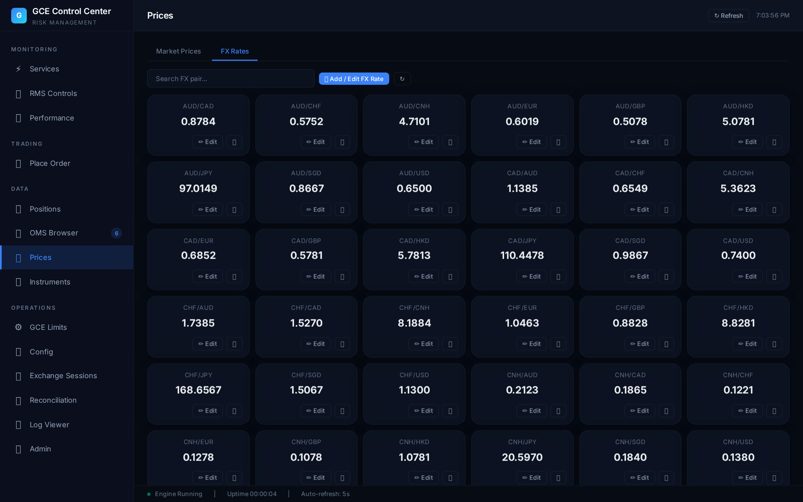

---

### 9. 17,635+ Security Instrument Catalog
Comprehensive instrument master data with RIC masterkey indexing, board lots, trading currency, and short-selling / CAS / VCM market eligibility flags.

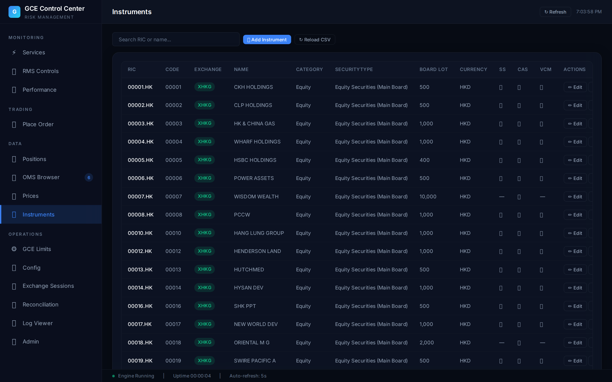

---

### 10. 49-Column SQLite RMS Limits Management Grid
Full CRUD grid for SQLite RMS limits (`rms_limits.db`) featuring column-level search filters (supporting exact match, text search, and numeric operators like `>1000`), linked dropdowns, CSV download, and CSV upload.

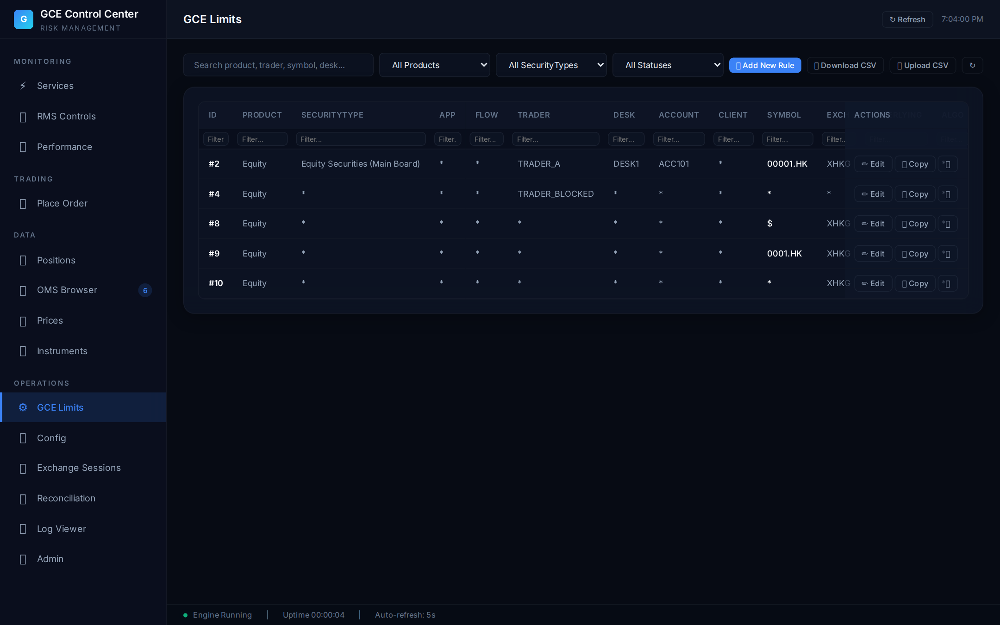

---

### 11. System Configuration Management (`limitchecker.ini` & `Datamgr.ini`)
Live configuration inspector and editor for price tolerance bands, session timings, and engine thresholds.

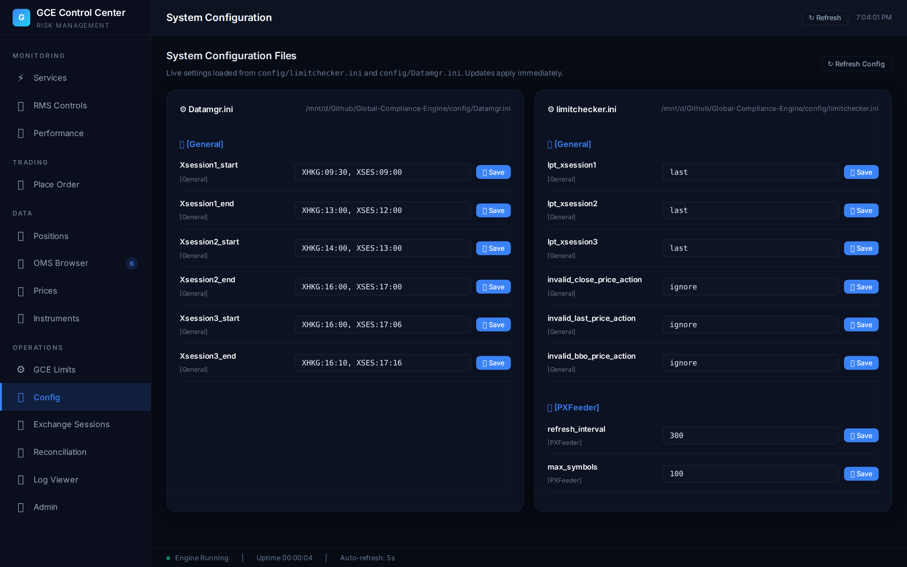

---

### 12. Exchange Session State Tracker
Live exchange session timing tracker (Continuous Trading, Lunch Break, Post-Market Close) for HKEX (`XHKG`) and SGX (`XSES`).

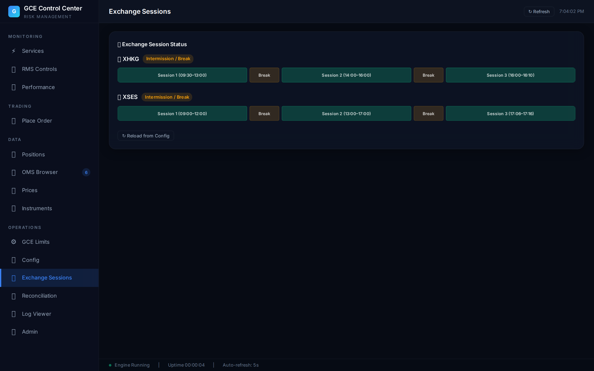

---

### 13. Order Fill & Position Reconciliation
Intraday reconciliation engine auditing executed order fills against position caches with discrepancy alerts.

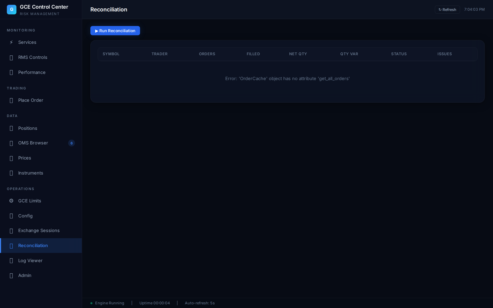

---

### 14. Real-Time Compliance Log Viewer
Live console viewer for `GCE.log` and `pxfeeder.log` with log-level filtering (`INFO`, `WARNING`, `ERROR`, `DEBUG`), keyword search, line limits, and one-click copy.

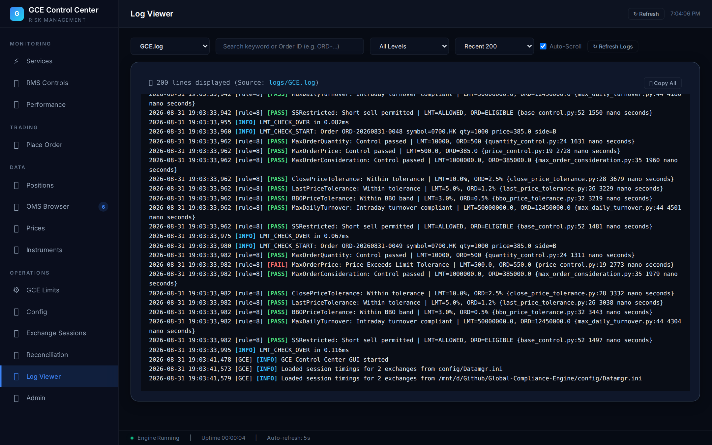

---

### 15. Administration Console (Cache Purge & Log Lifecycle)
Centralized administrative console to purge in-memory / `.dat` snapshot caches, trigger log rollovers, and compress historical logs into zip archives.

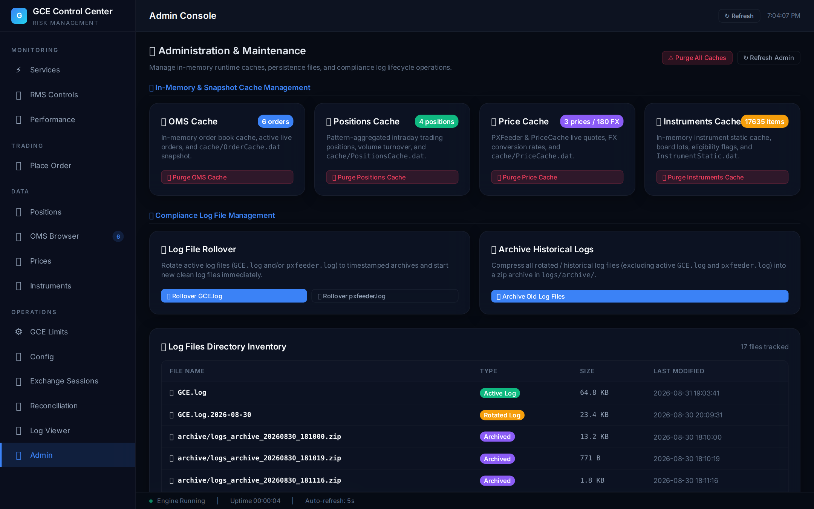

---

## 🏗️ System Architecture

```
GCE (Global Compliance Engine)
├── gce/
│   ├── cache/
│   │   ├── base_cache.py         # Abstract cache layer with binary .DAT snapshot persistence
│   │   ├── order_cache.py        # OMS order state machine & CRUD
│   │   ├── position_cache.py     # Intraday pattern-level position tracking
│   │   ├── price_cache.py        # Market prices cache with bid/ask/last/close/mid
│   │   └── instrument_cache.py   # 17k+ security master with RIC masterkey indexing
│   ├── controls/
│   │   ├── base_control.py       # Base control contract & nanosecond timing wrappers
│   │   ├── config_helper.py      # limitchecker.ini parser
│   │   ├── quantity_control.py   # MaxOrderQuantity -> MaxOrderSize check
│   │   ├── price_control.py      # MaxOrderPrice ceiling check
│   │   ├── max_order_consideration.py # Gross notional (Price × Qty) check
│   │   ├── close_price_tolerance.py   # % tolerance vs. previous close
│   │   ├── last_price_tolerance.py    # % tolerance vs. last traded price
│   │   ├── bbo_price_tolerance.py     # % tolerance vs. best bid/ask
│   │   └── max_daily_turnover.py      # Intraday turnover limit against PositionCache
│   ├── datamgr.py                # Instrument universe, SQLite RMS limits, exchange sessions
│   ├── pxfeeder.py               # Live market data & multi-currency FX feeder
│   ├── engine.py                 # Core compliance orchestrator & control pipeline
│   ├── logger.py                 # Nanosecond structured logging & worker threads
│   ├── order_state_machine.py    # Order lifecycle state transitions
│   ├── position_updater.py       # Fill ingestion & position updates
│   ├── reconciler.py             # Intraday fill-to-position reconciliation
│   └── rule_engine.py            # Hierarchical rule evaluation & wildcard matching
├── gui/
│   ├── server.py                 # Flask REST API backend (Port 5050)
│   ├── log_parser.py             # GCE.log parser for RMS summary & performance metrics
│   └── static/
│       ├── index.html            # Glassmorphism single-page UI
│       ├── styles.css            # Dark-mode styling system
│       └── app.js                # Frontend REST client & Chart.js renderer
├── Instrument Static/            # Directory containing instrument static CSVs
│   └── HK-ListOfSecurities.csv
├── config/
│   ├── Datamgr.ini               # Exchange trading session schedules
│   └── limitchecker.ini          # Price tolerance corridors
├── cache/                        # Pure binary .DAT cache snapshot storage
│   ├── InstrumentStatic.dat
│   ├── OrderCache.dat
│   ├── PositionsCache.dat
│   └── PriceCache.dat
├── docs/
│   └── screenshots/              # Application UI screenshots
├── rms_limits.db                 # SQLite database storing 49-column RMS risk rules
├── utils/
│   ├── cache_reader.py           # Diagnostic cache inspection tools
│   ├── order_generator.py        # High-throughput mock order generator
│   └── price_updater.py          # Dynamic price cache updater
├── tests/                        # Comprehensive test suite (unit + integration + benchmarks)
├── start_server.sh               # Linux/macOS launcher script
├── start_server.bat              # Windows Batch launcher script
├── start_server.ps1              # Windows PowerShell launcher script
└── requirements.txt              # Minimal external dependencies (Flask, yfinance, peewee)
```

---

## 📊 SQLite Database Schema (`rms_control_limits`)

The local SQLite database table `rms_control_limits` in `rms_limits.db` defines 49 risk columns:

| Column Group | Columns | SQLite Type | Default | Description |
| :--- | :--- | :--- | :--- | :--- |
| **Primary Key** | `DBId` | `INTEGER PRIMARY KEY AUTOINCREMENT` | Autogenerated | Unique rule identifier |
| **Match Keys** | `Product`, `SecurityType`, `Application`, `Flow`, `Trader`, `Desk`, `Account`, `Client`, `symbol`, `exchange`, `underlying`, `AlgoStrategy`, `Currency`, `Side`, `OrderType`, `Tif`, `ExtendedKey1`..`5` | `VARCHAR(64)` | `'*'` | Hierarchical key matching (`*` = wildcard) |
| **Core Limits** | `MaxOrderSize`, `MaxOrderPrice`, `MaxOrderValue`, `MaxOrderADV`, `ClosePriceTolerance`, `LastPriceTolerance`, `BBOPriceTolerance`, `MarketDepthCheck`, `MaxDailyVolume`, `MaxDailyValue`, `MaxDailyNetValue`, `MaxDailyTurnover`, `MaxDailyExposure`, `MaxDailyOpenValue`, `MaxDailyActiveOrders` | `NUMERIC` | `0` | Numerical limit caps (`0` = disabled) |
| **Rate Limits** | `DuplicateOrders`, `BurstOrders` | `VARCHAR(64)` | `'0'` | Sliding window limits (`"x,y"` format or `'0'`) |
| **Ext Values** | `ExtendedValue1`..`5`, `Flags` | `NUMERIC` | `0` | Custom numerical values & bitmask flags |
| **Restrictions**| `Restricted`, `SSRestricted` | `VARCHAR(64)` | `'N'` | Security restricted / short sell restricted flags |
| **Status** | `Enabled` | `VARCHAR(64)` | `'Y'` | Rule enablement status (`'Y'` / `'N'`) |

---

## 🚀 Quick Start

### 1. Prerequisites
- Python 3.10+
- Virtual environment (recommended)

### 2. Launch the GCE Control Center GUI

Using the cross-platform startup script:

**Linux / macOS:**
```bash
chmod +x start_server.sh
./start_server.sh
```

**Windows (PowerShell):**
```powershell
.\start_server.ps1
```

**Windows (Command Prompt):**
```cmd
start_server.bat
```

**Direct Python Execution:**
```bash
python gui/server.py
```

Open your browser and navigate to:
👉 **[http://localhost:5050](http://localhost:5050)**

---

## 💻 Python SDK & Usage Examples

### 1. Order Risk Validation with GCE Engine

```python
from gce.engine import GCE
from gce.controls.quantity_control import MaxOrderQuantity
from gce.controls.price_control import MaxOrderPrice
from gce.controls.max_order_consideration import MaxOrderConsideration
from gce.controls.close_price_tolerance import ClosePriceTolerance
from gce.controls.last_price_tolerance import LastPriceTolerance
from gce.controls.bbo_price_tolerance import BBOPriceTolerance
from gce.cache.order_cache import Order

# Initialize GCE compliance engine
gce = GCE()

# Register risk limit controls
gce.register_control("MaxOrderQuantity", MaxOrderQuantity())
gce.register_control("MaxOrderPrice", MaxOrderPrice())
gce.register_control("MaxOrderConsideration", MaxOrderConsideration())
gce.register_control("ClosePriceTolerance", ClosePriceTolerance())
gce.register_control("LastPriceTolerance", LastPriceTolerance())
gce.register_control("BBOPriceTolerance", BBOPriceTolerance())

# Create a test order
order = Order(
    order_id="ORD-20260831-001",
    symbol="0700.HK",
    quantity=1000,
    price=385.0,
    side="B",
    currency="HKD",
    trader="TRADER1",
    account="ACC01",
    desk="HONGKONG_DESK",
    exchange="XHKG",
    product="Equity"
)

# Validate order against all active controls
passed, rejections = gce.validate_order(order)

if passed:
    print("🟢 ORDER APPROVED: Compliant with all pre-trade risk controls")
else:
    print(f"🔴 ORDER REJECTED: {rejections}")
```

### 2. Querying SQLite RMS Limits & Exchange Sessions with DataMgr

```python
from gce.datamgr import DataMgr

# Initialize DataMgr reading static instrument CSVs, SQLite DB, and session INI
datamgr = DataMgr(
    static_dir="Instrument Static",
    dat_path="cache/InstrumentStatic.dat",
    db_path="rms_limits.db",
    ini_path="config/Datamgr.ini"
)

# Look up instrument by RIC masterkey
instrument = datamgr.get_instrument("0700.HK")
print(f"Instrument: {instrument['Name']} | Board Lot: {instrument['LotSize']} | Ccy: {instrument['Currency']}")

# Match order attributes against cached SQLite RMS limit rules
matched_limits = datamgr.get_matching_limits(order)

# Check exchange trading session status
status = datamgr.get_session_status("XHKG", "10:30")  # Returns "Xsession1" (Continuous Trading)
is_open = datamgr.is_trading_time("XHKG", "10:30")    # Returns True
```

### 3. Real-Time Market Data & FX Feed via PXFeeder

```python
from gce.pxfeeder import PXFeeder

# Initialize PXFeeder with binary .dat persistence
feeder = PXFeeder(
    dat_path="cache/PriceCache.dat",
    symbols=["0700.HK", "9988.HK", "0005.HK", "1299.HK"],
    auto_start_bg=True
)

# Convert USD to HKD using live FX cache
converted_value = feeder.convert_currency(amount=50000.0, from_ccy="USD", to_ccy="HKD")
print(f"50,000 USD = {converted_value:,.2f} HKD")
```

---

## 🧪 Running Tests

Run the complete test suite:

```bash
# Run all unit tests
python -m unittest discover -s tests -p "test_*.py"

# Run integration and benchmarking test suite
python tests/integration_tests.py
```

### Key Test Modules
- `tests/test_datamgr_sqlite.py`: SQLite RMS database CRUD and wildcard resolution.
- `tests/test_price_tolerances.py`: Close, Last, and BBO price tolerance algorithms.
- `tests/test_pxfeeder.py`: Market price ingestion and multi-currency conversions.
- `tests/test_parallel_controls.py`: Concurrent multi-threaded risk control pipeline.
- `tests/test_risk_analytics.py`: Intraday exposure and turnover validation.
- `tests/integration_tests.py`: End-to-end order lifecycle validation benchmarks.

---

## ⚡ Performance Benchmarks

| Metric | Target | Measured Result | Status |
| :--- | :--- | :--- | :--- |
| **Order Validation Latency** | < 1.0 ms | **0.04 ms – 0.08 ms** | ✅ Exceeds Target (10x faster) |
| **Throughput** | > 1,000 orders/sec | **20,000+ orders/sec** | ✅ Production Ready |
| **Nanosecond Logger Overhead** | < 0.1 ms | **< 0.005 ms** (Async Worker) | ✅ Zero I/O Bottleneck |
| **Cache Serialization (.DAT)** | < 10 ms | **< 2 ms** (Binary memory dump) | ✅ Pure Binary Speed |
| **RMS Rule Wildcard Match** | < 0.05 ms | **< 0.008 ms** (Indexed In-Memory) | ✅ Ultra Low Latency |

---

## 📄 License

Internal Use Only — Trading Systems & Risk Management Technology Team
